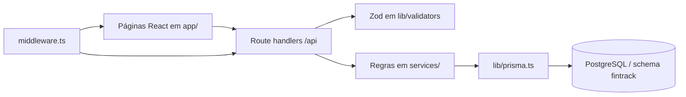

# Arquitetura

## Visão Geral

O FinTrack Pro é um monólito full-stack no App Router do Next.js 14. Não há microserviços ou provedores externos de autenticação: a API, as páginas, as regras de negócio e o acesso ao PostgreSQL vivem neste repositório.

## Limites de Responsabilidade

| Camada | Local | Responsabilidade |
| --- | --- | --- |
| Interface | `app/(auth)`, `app/(dashboard)`, `components/` | Renderização, formulários, feedback e navegação. |
| HTTP | `app/api/**/route.ts` | Método, parsing, resposta e mapeamento de erro HTTP. |
| Validação | `lib/validators/` | Contratos de entrada Zod. |
| Domínio | `services/` | Regras financeiras, autorização por `userId` e operações Prisma. |
| Infraestrutura | `lib/auth.ts`, `lib/prisma.ts` | Sessão JWT e conexão com banco. |
| Dados | `prisma/schema.prisma` | Modelos, relações e integridade referencial. |

Não coloque regra de saldo, categoria ou orçamento em componentes ou em route handlers. A alteração deve estar em `services/`, coberta pelo contrato de validação e refletida na documentação.

## Autenticação e Autorização

1. `POST /api/auth/login` ou `/register` valida dados e emite JWT HS256.
2. O token é armazenado no cookie HTTP-only `fintrack_token`, `sameSite=lax`, válido por sete dias.
3. `middleware.ts` deixa públicas apenas `/login`, `/register` e os dois endpoints de login/cadastro; o restante exige token válido.
4. Rotas de API usam `requireAuth()` para obter `userId`; serviços consultam e alteram registros com esse `userId` para impedir acesso cruzado.

Em produção, `JWT_SECRET` é obrigatório na prática: o fallback existe no código, mas não é seguro para ambiente publicado. Cookie `secure` é ativado quando `NODE_ENV=production`.

## Regras Financeiras Principais

- Toda moeda é armazenada em centavos inteiros, evitando erros de ponto flutuante.
- Criar receita incrementa o saldo da conta; criar despesa decrementa.
- Uma transferência cria uma despesa na origem e uma receita na conta destino, atualizando os dois saldos na mesma transação Prisma.
- Editar ou remover uma transação reverte o efeito anterior no saldo antes de aplicar a alteração/remover o registro.
- Contas com transações são arquivadas, não excluídas.
- Categorias padrão e categorias com transações não podem ser excluídas.
- Só existe um orçamento por combinação de usuário, categoria e período.

## Rotas de Interface

| Rota | Finalidade |
| --- | --- |
| `/login`, `/register` | Entrada e criação de conta. |
| `/dashboard` | Indicadores, fluxo de caixa, categorias, orçamentos e metas. |
| `/transactions` | Listagem, filtros, criação, edição, remoção e CSV. |
| `/accounts` | Contas e arquivamento. |
| `/budgets` | Orçamentos por categoria e período. |
| `/goals` | Metas financeiras. |
| `/analytics` | Séries e composição de receitas/despesas. |
| `/settings` | Perfil, senha, categorias e exclusão da conta. |
